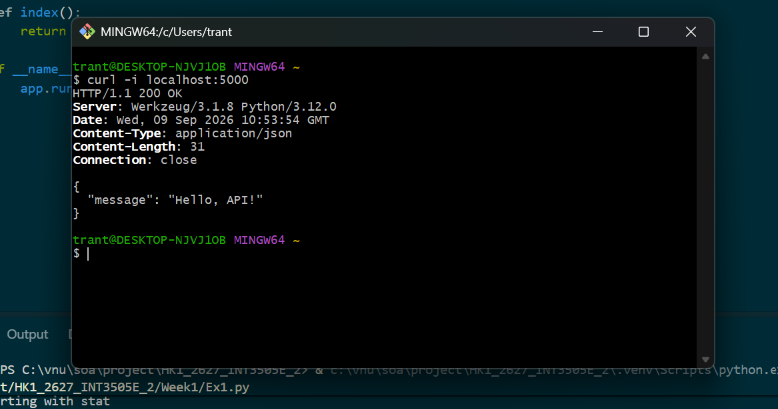
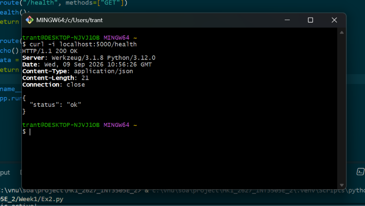
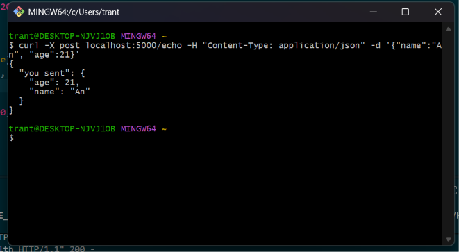
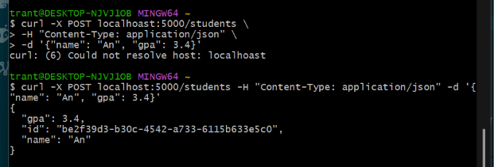
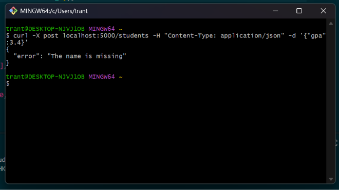
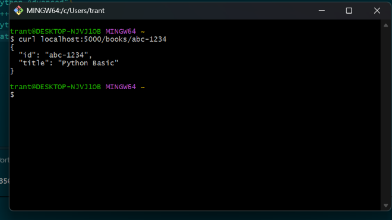
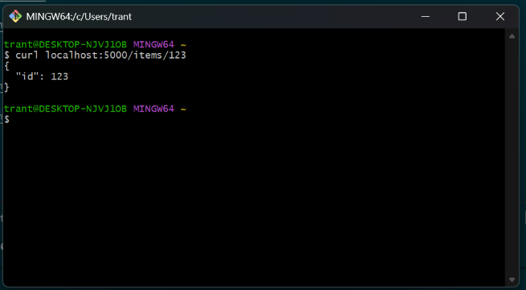

# Week 1

## Bài 1: Execute và test



## Bài 2: Health check và echo

### `GET /health`



### `POST /echo`



## Bài 3: Tạo resource

### `POST` thành công - `201 Created`



### `POST` thiếu name - `400 Bad Request`



## Bài 4: Path parameters và query string

### Path parameters

#### `GET /books/<book_id>`



#### `GET /items/<item_id>`



### Query string

Tìm tối đa 5 kết quả có `title = "Python"`.

```python
BOOKS = [
    {"id": "abc-1234", "title": "Python Basic"},
    {"id": "book-001", "title": "Java Programming"},
    {"id": "book-002", "title": "Python Advanced"},
    {"id": "book-003", "title": "C++ Programming"},
    {"id": "book-004", "title": "Python Web Development"},
    {"id": "book-005", "title": "Database"},
]
```


## Bài 5: Xóa resource

### `DELETE` bị từ chối - `409 Conflict`


### `DELETE` không tìm thấy - `404 Not Found`


### `DELETE` thành công - `204 No Content`


### Log trên server


## Bài 6: CRUD với books

### `GET /books` - `200 OK`, danh sách books


### `GET /books/<id>` - `200 OK`, chi tiết book tồn tại


### `GET /books/<id>` - `404 Not Found`, book không tồn tại


### `POST /books` - `201 Created`


### `PUT /books/<id>` - `200 OK`


### `DELETE /books/<id>` - `204 No Content`


### `POST /books` với body rỗng - `400 Bad Request`


