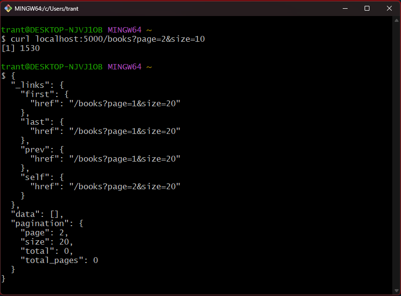
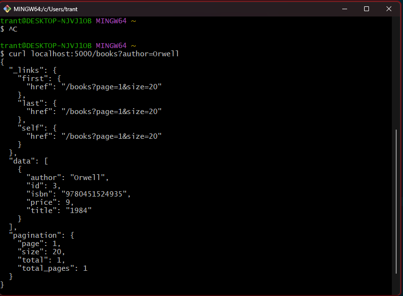
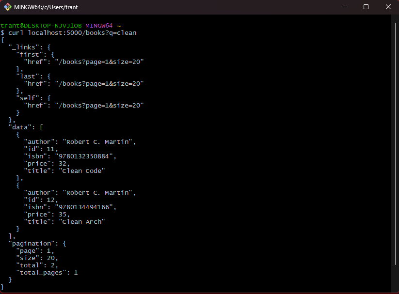

# Week 2

## Bài 1: CRUD với books

### `GET /books` - Lấy danh sách books

### `POST /books` - Tạo book thành công

### `POST /books` thiếu Content-Type - `415 Unsupported Media Type`

### `POST /books` thiếu trường bắt buộc - `422 Unprocessable Entity`

## Bài 2: Phân trang, lọc và tìm kiếm books

### Phân trang với `page` và `size`

### Lọc theo tác giả với `author`

### Tìm kiếm theo tiêu đề với `q`

### Yêu cầu response dạng JSON

## Assignments Ex1: Lấy order theo ID

### `GET /orders/<id>` - Lấy order tồn tại

## Assignments Ex3: ETag và cập nhật book

### `GET /books/1` - Lấy book lần đầu và nhận ETag

### `GET /books/1` với `If-None-Match` - `304 Not Modified`

### `PATCH /books/1` - Cập nhật book thành công - Đổi lại data mới

### `GET /books/1` sau khi cập nhật Etag cập nhật và không trả về 304 nữa

