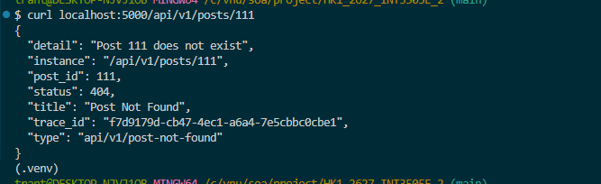
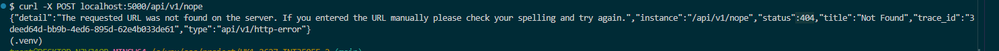
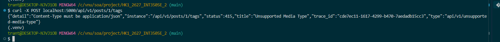

# Week 3 — Lab 2: Problem Details for REST API
## 1. Vấn đề cần giải
| Nguồn lỗi | Response trước Lab 2 |
|---|---|
| `raise ProblemError` | `application/json`, không có `trace_id` |
| `jsonify({"error": ...})` viết tay | `application/json`, thiếu `status`, thiếu `detail` |
| Route không tồn tại (Werkzeug) | `text/html` |
| Sai method (Werkzeug) | `text/html` |
| Bug trong code (Python) | `text/html` 500 |

## 2. Cấu trúc response `problem+json`
```json
{
  "type": "api/v1/post-not-found",
  "title": "Post Not Found",
  "status": 404,
  "instance": "/api/v1/posts/999",
  "trace_id": "baf786fe-2c86-4e79-9f20-e8d5d05b423c",
  "detail": "Post 999 does not exist",
  "post_id": 999
}
```

## 3. Kết quả kiểm chứng
### `GET /api/v1/posts/999` — Post không tồn tại — `404 Not Found`

### Route không tồn tại — `404` chuyển từ HTML sang JSON

### Thiếu `Content-Type: application/json` — `415 Unsupported Media Type`

